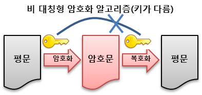

# 2026-06-16 1일 1CS/면접 지식

## 오늘의 CS 지식

[ 비대칭키 방식(공개키 방식) ]

## 카테고리

`algorithm`

## 핵심 요약

- [ 비대칭키 방식(공개키 방식) ]는 암호키 ≠ 복호키, 키의 수, 키의 관리 같은 구성 요소를 구분해서 이해하는 주제입니다.
- 각 요소가 어떤 입력과 출력을 가지는지, 그리고 실제 시스템에서 어떤 역할을 하는지 연결해서 보면 좋습니다.
- 면접에서는 용어 정의만 외우기보다 서로의 관계와 차이를 함께 설명하는 것이 중요합니다.

## 조금 더 자세히

> 메시지 암호화 하는 키와 복호화 하는 키가 다른 알고리즘 (공개키와 암호화키)



- **암호키 ≠ 복호키**
  - 키의 수 : 전송 당사자간에 각각 **키쌍(Private Key, Public Key)** 를 공유
  - 키의 관리 : 인증기관을 통해 전송 당사자 별 Private Key 발급
  - 암호화 키 : Public Key
  - 복호화 키 : Private Key
- 키의 이원화로 **부인방지 가능**
- 큰 소수를 찾거나, 곡률 방정식 등의 연산으로 속도가 느림
- 용도 : 다수의 정보교환(Key)에 주로 사용
- 장점 : 암호해독이 어려움(보안 강화)
- 단점 : 해독시간이 상대적으로 오래 걸림, 중간자 공격
- 전자서명, 공인인증서 등에서도 사용함
- 구현 방식 :
  - `소인수분해`(RSA), `이산대수`(DSA, ECC), `근저백터`(Lattice)
  - `전자 서명(Digital Signature)` : 인터넷 상에서 본인임을 증명하기 위해 서명을 하는 수단, 공개키 암호를 거꾸로 활용하는 방식(ex. DSA, RSA, Signature, ECDSA)

> **중간자 공격**
>
> 해커가 중간에서 통신을 가로채어 수신자에게는 송신자인척하고, 송신자에게는 수신자인 척 하여 양쪽의 공개키와 실제 암호화에 사용되는 대칭키를 모두 얻어내는 기법

#### 예시 (인터넷 뱅킹)
```
1. 👩‍💻 사용자가 인터넷 은행 사이트 접속
  - 💻(사용자의 컴퓨터) : 공개키, 비밀키 생성
2. 🔑 사용자의 공개키가 은행으로 전송
3. 🏧 은행에서 중요한 정보 공개키로 암호화하여 암호문 사용자에게 전달
4. 👩‍💻 사용자는 비밀키로 암호문을 해독하여 중요한 정보를 은행과 공유하며 통신
```

#### 중점에 따른 암호화 방식
`Public Key`로 암호화 하면 **Data 보안**에 중점을 두고, `Private Key`로 암호화 하면 **인증 과정**에 중점을 둔다.

## 면접 포인트

- [ 비대칭키 방식(공개키 방식) ]: 무엇인지 한 문장으로 설명할 수 있어야 합니다.
- 핵심 키워드: key, 암호화, 방식, private, 공개키
- 비슷한 개념과 비교했을 때 어떤 차이가 있는지 정리해두면 좋습니다.
- 실무에서 성능, 안정성, 확장성 중 무엇에 영향을 주는지 연결해서 생각해봅니다.

## 연관되어 자주 나오는 면접 질문

- [ 비대칭키 방식(공개키 방식) ]를 한 문장으로 설명해주세요.
- [ 비대칭키 방식(공개키 방식) ]가 필요한 이유는 무엇인가요?
- [ 비대칭키 방식(공개키 방식) ]의 장점과 단점은 무엇인가요?
- [ 비대칭키 방식(공개키 방식) ]와 비슷한 개념을 비교해서 설명해주세요.
- 실무에서 [ 비대칭키 방식(공개키 방식) ]를 사용할 때 주의할 점은 무엇인가요?

## 면접 답변 예시

### [ 비대칭키 방식(공개키 방식) ]를 한 문장으로 설명해주세요.

비대칭키 방식은 서로 다른 두 키인 공개키와 개인키를 한 쌍으로 사용해서, 한 키로 암호화한 데이터는 대응되는 다른 키로만 복호화할 수 있게 하는 암호화 방식입니다.

### [ 비대칭키 방식(공개키 방식) ]가 필요한 이유는 무엇인가요?

대칭키 방식은 통신 전에 같은 비밀키를 양쪽이 안전하게 공유해야 하는 문제가 있습니다. 비대칭키 방식은 공개키를 외부에 공개해도 개인키만 안전하게 보관하면 되기 때문에, 처음 만나는 상대와도 안전하게 키를 교환하거나 상대의 신원을 검증할 수 있습니다. 실제 HTTPS에서도 서버 인증과 세션키 교환 과정에 비대칭키 방식이 사용되고, 이후 대용량 데이터 통신은 더 빠른 대칭키 방식으로 처리합니다.

### [ 비대칭키 방식(공개키 방식) ]의 장점과 단점은 무엇인가요?

장점은 키 분배가 비교적 쉽고, 개인키를 소유한 주체만 복호화나 서명을 할 수 있어 기밀성, 인증, 전자서명, 부인 방지에 활용할 수 있다는 점입니다.

단점은 RSA나 ECC 같은 연산이 대칭키 암호화보다 무겁기 때문에 대용량 데이터를 직접 암호화하기에는 비효율적이라는 점입니다. 또한 공개키가 정말 상대방의 공개키인지 검증하지 않으면 중간자 공격을 받을 수 있으므로, 인증서와 신뢰할 수 있는 인증기관 같은 검증 체계가 필요합니다.

### [ 비대칭키 방식(공개키 방식) ]와 비슷한 개념을 비교해서 설명해주세요.

대칭키 방식은 암호화와 복호화에 같은 키를 사용합니다. 속도가 빠르기 때문에 실제 데이터 암호화에 적합하지만, 키를 안전하게 공유하는 것이 어렵습니다.

반면 비대칭키 방식은 공개키와 개인키를 나누어 사용합니다. 속도는 느리지만 키 교환, 인증, 전자서명에 강점이 있습니다. 그래서 실무에서는 둘 중 하나만 쓰기보다, 비대칭키로 안전하게 대칭키를 교환하고 이후 통신은 대칭키로 암호화하는 하이브리드 방식을 주로 사용합니다.

### 실무에서 [ 비대칭키 방식(공개키 방식) ]를 사용할 때 주의할 점은 무엇인가요?

가장 중요한 것은 개인키를 절대 노출하지 않는 것입니다. 개인키가 유출되면 공격자가 복호화나 서명을 대신 수행할 수 있으므로, 파일 권한 관리, 키 저장소, KMS, HSM 같은 보호 수단을 고려해야 합니다.

또한 공개키 자체는 공개되어도 되지만, 그 공개키가 신뢰할 수 있는 주체의 것인지 검증해야 합니다. HTTPS에서는 인증서 체인, 만료일, 도메인 일치 여부, 폐기 여부를 확인합니다. 성능 측면에서는 비대칭키로 큰 데이터를 직접 암호화하지 않고, 세션키 교환이나 서명 검증처럼 필요한 범위에만 사용하는 것이 좋습니다.

## 오늘의 복습

- 오늘 예정된 간격 복습은 없습니다.
