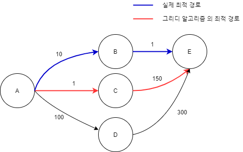

# 2026-06-18 1일 2CS/면접 지식

## 오늘의 CS 지식

그리디 알고리즘(Greedy Algorithm) 💸

## 카테고리

`algorithm`

## 핵심 요약

- 그리디 알고리즘은 매 단계에서 현재 가장 좋아 보이는 선택을 하며 해답을 만들어가는 알고리즘 기법입니다.
- 빠르고 구현이 단순한 경우가 많지만, 항상 최적해를 보장하지는 않습니다.
- 탐욕 선택 속성과 최적 부분 구조가 성립하는지 확인해야 그리디 풀이를 정당화할 수 있습니다.

## 조금 더 자세히

> **눈 앞의 이익만 우선 추구**하는 알고리즘
>
 매 선택에서 **현재 당장 최적**인 답을 선택해 전체 적합한 결과를 도출하자는 알고리즘 기법



그리디 알고리즘을 이용하면, 부분 최적해는 구했지만 전체 선택에서는 오히려 최적이 아닌 경로를 선택하여 전체 문제에서의 최적값은 구하지 못하게 된다.

**특수한 조건**이 만족되어야만 그리디를 이용하여 최적해를 구할 수 있다.

그리디로 문제를 풀 때는 보통 아래 흐름으로 생각합니다.

1. 선택 절차: 현재 상태에서 가장 좋아 보이는 선택 기준을 정합니다.
2. 적절성 검사: 선택한 후보가 문제의 조건을 깨지 않는지 확인합니다.
3. 해답 검사: 문제가 해결됐는지 확인하고, 아직 아니라면 같은 기준으로 다음 선택을 이어갑니다.

그리디가 정답이 되려면 선택 기준이 단순히 "좋아 보이는 선택"에 그치면 안 됩니다. 현재 선택이 이후 선택과 충돌하지 않는다는 탐욕 선택 속성, 부분 문제의 최적해가 전체 문제의 최적해로 이어지는 최적 부분 구조를 설명할 수 있어야 합니다.

대표 예시는 회의실 배정 문제입니다. 가장 빨리 끝나는 회의를 먼저 선택하면 남은 시간에 더 많은 회의를 배치할 가능성이 커지고, 이 선택 기준은 전체 최적해로 이어진다는 것을 증명할 수 있습니다. 반면 동전 거스름돈 문제는 동전 체계에 따라 큰 단위부터 고르는 방식이 틀릴 수 있으므로 반례를 확인해야 합니다.

## 면접 포인트

- 그리디 알고리즘: 매 순간의 최선 선택으로 전체 해답을 구성하는 방식이라고 설명할 수 있어야 합니다.
- 핵심 키워드: 탐욕 선택 속성, 최적 부분 구조, 정렬, 반례, 시간 복잡도
- 완전탐색/동적 계획법과 비교해 탐색 범위를 줄이는 대신 정당성 증명이 필요하다는 점을 말할 수 있어야 합니다.
- 회의실 배정, 거스름돈처럼 어떤 선택 기준이 전체 최적해로 이어지는지 예시로 설명하면 좋습니다.

## 연관되어 자주 나오는 면접 질문

- 그리디 알고리즘(Greedy Algorithm) 💸를 한 문장으로 설명해주세요.
- 그리디 알고리즘(Greedy Algorithm) 💸가 필요한 이유는 무엇인가요?
- 그리디 알고리즘(Greedy Algorithm) 💸의 장점과 단점은 무엇인가요?
- 그리디 알고리즘(Greedy Algorithm) 💸와 비슷한 개념을 비교해서 설명해주세요.
- 실무에서 그리디 알고리즘(Greedy Algorithm) 💸를 사용할 때 주의할 점은 무엇인가요?

## 면접 답변 예시

### 그리디 알고리즘(Greedy Algorithm) 💸를 한 문장으로 설명해주세요.

그리디 알고리즘(Greedy Algorithm) 💸는 매 단계에서 현재 가장 좋아 보이는 선택을 하며 전체 해답을 만들어가는 알고리즘 기법입니다.

### 그리디 알고리즘(Greedy Algorithm) 💸가 필요한 이유는 무엇인가요?

문제의 조건이 맞다면 모든 경우를 탐색하지 않고도 빠르게 해답을 구할 수 있기 때문입니다. 특히 정렬 후 일정한 기준으로 선택을 반복하는 문제에서 구현이 단순하고 시간 복잡도를 크게 줄일 수 있습니다.

### 그리디 알고리즘(Greedy Algorithm) 💸의 장점과 단점은 무엇인가요?

장점은 구현이 비교적 간단하고, 조건이 맞으면 매우 효율적으로 최적해를 구할 수 있다는 점입니다.

단점은 현재의 최선 선택이 전체 최적해로 이어진다는 보장이 없으면 오답이 될 수 있다는 점입니다. 그래서 그리디를 사용할 때는 탐욕 선택 속성과 최적 부분 구조가 성립하는지, 반례가 없는지 확인해야 합니다.

### 그리디 알고리즘(Greedy Algorithm) 💸와 완전탐색, 동적 계획법을 비교해서 설명해주세요.

완전탐색은 가능한 모든 후보를 확인하고, 동적 계획법은 중복 부분 문제의 결과를 저장해 탐색량을 줄입니다. 반면 그리디는 매 순간 하나의 선택 기준으로 후보를 줄이며 진행합니다. 그래서 그리디는 빠르지만, 선택 기준이 항상 최적해를 보장한다는 정당성 설명이 필요합니다.

### 그리디 알고리즘(Greedy Algorithm) 💸를 사용할 때 주의할 점은 무엇인가요?

선택 기준을 먼저 정하고, 그 기준이 항상 전체 최적해로 이어지는지 검증해야 합니다. 예를 들어 일부 동전 체계에서는 큰 동전부터 고르는 방식이 맞지만, 모든 동전 체계에서 맞는 것은 아니므로 반례를 확인하는 습관이 중요합니다.

---

## 오늘의 Spring 백엔드 지식

Controller-Service-Repository 계층 분리

## Spring 핵심 요약

- Spring 백엔드의 기본 구조는 Controller, Service, Repository 계층으로 책임을 나누는 것입니다.
- 계층 분리는 코드 위치를 나누는 일이 아니라 변경 이유와 테스트 범위를 나누는 일입니다.
- 면접에서는 각 계층의 책임뿐 아니라 Controller가 비대해지는 문제, 트랜잭션 경계, 테스트 전략까지 함께 설명하는 것이 좋습니다.

## Spring 조금 더 자세히

- Controller는 HTTP 요청/응답, 라우팅, 파라미터 바인딩, 입력 검증, 상태 코드 변환을 담당합니다. 요청을 받은 뒤에는 비즈니스 판단을 직접 하지 않고 Service에 유스케이스 실행을 위임합니다.
- Service는 하나의 유스케이스를 처리하는 계층입니다. 여러 Repository 호출을 조합하고, 도메인 규칙을 적용하며, 보통 이곳에 `@Transactional`을 두어 작업 단위를 명확히 합니다.
- Repository는 DB 접근을 추상화하고 쿼리나 영속성 기술의 세부 사항을 감춥니다. Service는 Repository 인터페이스를 통해 필요한 데이터를 요청하고, SQL/JPA 구현 세부 사항에 덜 의존하게 됩니다.
- 계층 분리는 변경의 전파를 줄입니다. API 표현 방식이 바뀌면 Controller와 DTO 중심으로, 비즈니스 규칙이 바뀌면 Service 중심으로, 쿼리 방식이 바뀌면 Repository 중심으로 수정 범위를 좁힐 수 있습니다.

## Spring 구현 체크리스트

- Controller에서는 요청 DTO 검증, PathVariable/RequestParam 처리, 응답 DTO 반환에 집중합니다.
- Service 메서드는 `createOwner`, `registerVisit`, `changePassword`처럼 유스케이스 단위로 이름을 짓습니다.
- 변경 작업 Service에는 보통 `@Transactional`을 두고, 단순 조회는 `@Transactional(readOnly = true)`를 검토합니다.
- Repository는 조회 조건과 저장/삭제 같은 데이터 접근 책임에 집중하고, 화면/API 전용 조합 로직은 무리하게 넣지 않습니다.
- 테스트는 Controller 슬라이스 테스트, Service 단위 테스트, Repository 통합 테스트처럼 검증 목적에 맞게 나눕니다.

## Spring 코드 예시

### 계층별 책임 예시

```java
@RestController
@RequestMapping("/api/owners")
class OwnerController {

    private final OwnerService ownerService;

    OwnerController(OwnerService ownerService) {
        this.ownerService = ownerService;
    }

    @PostMapping
    @ResponseStatus(HttpStatus.CREATED)
    OwnerResponse create(@Valid @RequestBody CreateOwnerRequest request) {
        return ownerService.createOwner(request);
    }
}

@Service
class OwnerService {

    private final OwnerRepository ownerRepository;

    OwnerService(OwnerRepository ownerRepository) {
        this.ownerRepository = ownerRepository;
    }

    @Transactional
    OwnerResponse createOwner(CreateOwnerRequest request) {
        if (ownerRepository.existsByPhone(request.phone())) {
            throw new DuplicateOwnerPhoneException(request.phone());
        }

        Owner owner = new Owner(request.name(), request.phone());
        Owner savedOwner = ownerRepository.save(owner);
        return OwnerResponse.from(savedOwner);
    }
}

interface OwnerRepository extends JpaRepository<Owner, Long> {
    boolean existsByPhone(String phone);
}
```

### 테스트 관점 예시

```java
@ExtendWith(MockitoExtension.class)
class OwnerServiceTest {

    @Mock
    OwnerRepository ownerRepository;

    @InjectMocks
    OwnerService ownerService;

    @Test
    void duplicatedPhoneCannotBeRegistered() {
        CreateOwnerRequest request = new CreateOwnerRequest("Kim", "010-1111-2222");
        given(ownerRepository.existsByPhone(request.phone())).willReturn(true);

        assertThatThrownBy(() -> ownerService.createOwner(request))
                .isInstanceOf(DuplicateOwnerPhoneException.class);
    }
}
```


### PetClinic 참고 포인트

- PetClinic의 owner, vet, visit 관련 패키지를 보면 웹 계층과 데이터 접근 계층이 어떻게 나뉘는지 확인할 수 있습니다.

## Spring 면접 질문

- Controller, Service, Repository를 나누는 이유는 무엇인가요?
- Service 계층에 트랜잭션을 두는 이유는 무엇인가요?
- Controller에 비즈니스 로직이 많아지면 어떤 문제가 생기나요?
- 계층 분리가 테스트에 주는 장점은 무엇인가요?
- Service와 Repository 중 어디에 비즈니스 규칙을 두는 것이 좋나요?

## Spring 면접 답변 예시

Controller, Service, Repository를 나누는 이유는 각 코드의 변경 이유와 테스트 범위를 분리하기 위해서입니다. Controller는 HTTP 요청/응답과 입력 검증, Service는 비즈니스 유스케이스와 트랜잭션 경계, Repository는 데이터 접근을 담당합니다. 예를 들어 API 응답 형식이 바뀌면 Controller와 DTO 위주로 수정하고, 주문 생성 규칙이 바뀌면 Service를 수정하며, 쿼리 최적화가 필요하면 Repository를 수정하는 식으로 변경 범위를 줄일 수 있습니다. Service에 트랜잭션을 두는 이유는 하나의 유스케이스 안에서 여러 데이터 변경이 함께 성공하거나 함께 실패해야 하기 때문입니다. Controller에 비즈니스 로직이 쌓이면 HTTP 계층과 핵심 로직이 강하게 결합되어 재사용과 테스트가 어려워지므로, Controller는 얇게 유지하고 Service에서 정책을 표현하는 것이 좋습니다.
