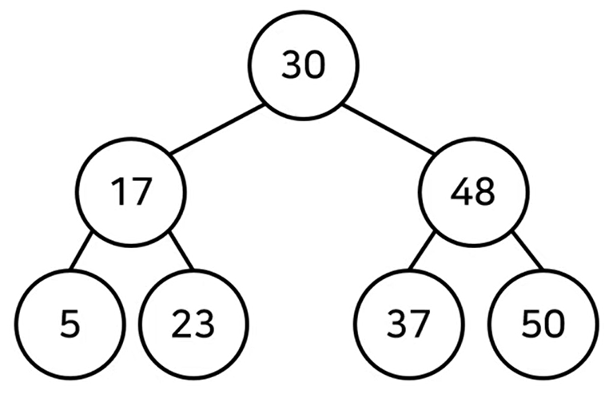
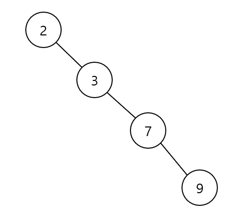

# 2026-06-23 1일 2CS/면접 지식

---

# 오늘의 CS 지식

## 주제

[ 이진 탐색 트리(BST,Binary Search Tree)의 단점 ]

## 카테고리

`algorithm`

## 핵심 요약

- 균등 트리 : 노드 개수가 N개일 때 O(logN) 편향 트리 : 노드 개수가 N개일 때 O(N) 이진 탐색 트리는 최악의 경우 한쪽으로 편향된 트리일 때 O(N) 시간이 걸린
- 이 말은 모든 노드를 한 번씩 다 확인해줘야 한다는 의미이
- 이러한 단점을 개선한 균형 트리 인 Red-Black 트리 에 대해서 알아보자.

## 면접 포인트

| 질문 포인트 | 핵심 키워드 |
| --- | --- |
| 정의 | [ 이진 탐색 트리(BST,Binary Search Tree)의 단점 ]를 한 문장으로 설명 |
| 동작 원리 | 트리, 노드, 개수, 개일 |
| 장점 | 무엇을 더 빠르게, 단순하게, 안정적으로 만드는지 설명 |
| 단점 | 성능, 복잡도, 운영 부담, 예외 상황 설명 |
| 비교 개념 | 비슷한 개념과 책임, 사용 시점, 비용 비교 |
| 실무 활용 | Java/Spring 백엔드에서의 사용 사례와 주의점 연결 |

## 자주 나오는 면접 질문

| 질문 | 핵심 답변 방향 |
| --- | --- |
| [ 이진 탐색 트리(BST,Binary Search Tree)의 단점 ]를 한 문장으로 설명해주세요. | 발생 원인, 영향, 대안을 함께 설명합니다. |
| [ 이진 탐색 트리(BST,Binary Search Tree)의 단점 ]가 필요한 이유는 무엇인가요? | 해결하려는 문제와 얻는 장점을 함께 설명합니다. |
| [ 이진 탐색 트리(BST,Binary Search Tree)의 단점 ]의 장점과 단점은 무엇인가요? | 발생 원인, 영향, 대안을 함께 설명합니다. |
| [ 이진 탐색 트리(BST,Binary Search Tree)의 단점 ]와 비슷한 개념을 비교해서 설명해주세요. | 발생 원인, 영향, 대안을 함께 설명합니다. |
| 실무에서 [ 이진 탐색 트리(BST,Binary Search Tree)의 단점 ]를 사용할 때 주의할 점은 무엇인가요? | 발생 원인, 영향, 대안을 함께 설명합니다. |

## 면접 답변 예시

### 이진 탐색 트리(BST,Binary Search Tree)의 단점를 한 문장으로 설명해주세요.

균등 트리 : 노드 개수가 N개일 때 O(logN) 편향 트리 : 노드 개수가 N개일 때 O(N) 이진 탐색 트리는 최악의 경우 한쪽으로 편향된 트리일 때 O(N) 시간이 걸린

### 이진 탐색 트리(BST,Binary Search Tree)의 단점과 필요한 이유는 무엇인가요?

이진 탐색 트리(BST,Binary Search Tree)의 단점는 `algorithm` 영역에서 문제를 정확히 이해하고 시스템의 동작 방식이나 트레이드오프를 설명하기 위해 필요한 개념입니다. 면접에서는 단순 정의보다 어떤 상황에서 이 개념이 등장하고, 어떤 문제를 해결하는지까지 연결해서 말하는 것이 좋습니다.

### 이진 탐색 트리(BST,Binary Search Tree)의 장점과 단점은 무엇인가요?

장점은 트리, 노드, 개수, 개일, 단점를 기준으로 동작 원리와 사용 목적을 명확하게 설명할 수 있다는 점입니다.

단점이나 주의점은 실제 적용 시 성능, 복잡도, 안정성, 운영 부담 중 어떤 비용이 생기는지 함께 검토해야 한다는 점입니다. 원문에 나온 조건과 예외 상황을 함께 정리하면 답변이 더 탄탄해집니다.

### 이진 탐색 트리(BST,Binary Search Tree)의 단점와 비슷한 개념을 비교해서 설명해주세요.

먼저 이진 탐색 트리(BST,Binary Search Tree)의 단점의 핵심 기준을 잡고, 비슷한 개념과 입력, 출력, 책임, 사용 시점이 어떻게 다른지 비교하면 됩니다. 차이를 설명할 때는 "무엇을 해결하려는가"와 "어떤 비용을 감수하는가"를 같이 말하면 면접 답변이 자연스럽습니다.

### 실무에서 이진 탐색 트리(BST,Binary Search Tree)의 단점를 사용할 때 주의할 점은 무엇인가요?

실무에서는 이 개념이 적용되는 범위와 한계를 먼저 확인해야 합니다. 특히 데이터 크기, 장애 상황, 보안 요구사항, 성능 병목처럼 운영 환경에서 문제가 될 수 있는 조건을 함께 고려하는 것이 중요합니다.

## 실무 관점

- `algorithm` 영역에서 [ 이진 탐색 트리(BST,Binary Search Tree)의 단점 ]가 실제 시스템의 성능, 안정성, 유지보수성에 어떤 영향을 주는지 연결해 봅니다.
- 비슷한 개념과 비교하면서 언제 이 개념을 선택하고 언제 다른 대안을 선택할지 정리합니다.
- 운영 환경에서는 데이터 크기, 장애 상황, 보안 요구사항, 성능 병목을 함께 고려합니다.

## 코드 예시

이 주제는 코드보다 개념의 동작 원리와 비교 기준을 중심으로 정리합니다.

## 상세 설명

> `균등 트리` : 노드 개수가 N개일 때 O(logN)

> `편향 트리` : 노드 개수가 N개일 때 **O(N)**

이진 탐색 트리는 최악의 경우 한쪽으로 편향된 트리일 때 O(N) 시간이 걸린다.

이 말은 모든 노드를 한 번씩 다 확인해줘야 한다는 의미이다.





이러한 단점을 개선한 **균형 트리**인 **Red-Black 트리**에 대해서 알아보자.

---

# 오늘의 Spring 백엔드 지식

## 주제

Spring 트랜잭션과 @Transactional

## Spring 핵심 요약

- `@Transactional`은 하나의 유스케이스를 원자적으로 처리하기 위한 Spring의 트랜잭션 선언 방식입니다.
- 일반적으로 Service 계층에 트랜잭션 경계를 두고, Repository 호출들을 하나의 작업 단위로 묶습니다.
- 읽기 전용, 롤백 규칙, 프록시 기반 동작, 영속성 컨텍스트와의 관계까지 함께 이해해야 합니다.

## 동작 원리

1. 클라이언트 코드가 `@Transactional`이 붙은 Service 메서드를 호출합니다.
2. Spring AOP 프록시가 호출을 가로채 트랜잭션을 시작합니다.
3. Service 로직과 Repository 호출이 같은 트랜잭션 안에서 실행됩니다.
4. 정상 종료되면 commit하고, 롤백 대상 예외가 발생하면 rollback합니다.

## 내부 구성 요소

| 구성 요소 | 역할 |
| --- | --- |
| TransactionManager | 트랜잭션 시작, commit, rollback을 담당합니다. |
| AOP Proxy | `@Transactional` 메서드 호출을 감싸 트랜잭션을 적용합니다. |
| Persistence Context | JPA Entity 변경을 추적합니다. |
| Rollback Rule | 어떤 예외에서 rollback할지 결정합니다. |

## 실무 구현 포인트

| 상황 | 권장 방식 | 이유 |
| --- | --- | --- |
| 변경 작업 유스케이스 | Service 메서드에 `@Transactional`을 둡니다 | 책임과 변경 범위를 명확히 하기 위해서입니다. |
| 조회 전용 유스케이스 | `@Transactional(readOnly = true)`를 검토합니다 | 책임과 변경 범위를 명확히 하기 위해서입니다. |
| 실무 적용 | 트랜잭션 안에서 외부 API 호출을 오래 잡고 있지 않도록 주의합니다 | 일관된 구조와 유지보수성을 높이기 위해서입니다. |
| 실무 적용 | 내부 호출, private 메서드, self-invocation 상황에서 트랜잭션 적용 여부를 확인합니다 | 일관된 구조와 유지보수성을 높이기 위해서입니다. |

## 주의사항

- self-invocation에서는 프록시 기반 트랜잭션이 적용되지 않을 수 있습니다.
- 트랜잭션 안에서 외부 API 호출을 오래 잡고 있지 않도록 합니다.
- checked exception은 기본 rollback 대상이 아니므로 정책을 확인합니다.
- 읽기 전용 조회는 `readOnly = true`를 검토합니다.

## 코드 예시

```java
@Service
public class OrderService {

    @Transactional
    public Long createOrder(CreateOrderRequest request) {
        Order order = orderRepository.save(request.toEntity());
        paymentHistoryRepository.save(PaymentHistory.from(order));
        return order.getId();
    }
}
```

## 자주 나오는 꼬리 질문

| 질문 | 핵심 답변 방향 |
| --- | --- |
| `@Transactional`은 어느 계층에 두는 것이 일반적인가요? | 정의, 동작 원리, 실무 주의점을 연결해 답변합니다. |
| Spring 트랜잭션의 기본 롤백 조건은 무엇인가요? | 정의, 동작 원리, 실무 주의점을 연결해 답변합니다. |
| 프록시 기반 트랜잭션에서 self-invocation 문제가 무엇인가요? | 발생 원인, 영향, 대안을 함께 설명합니다. |
| `readOnly = true`는 언제 사용하나요? | 정의, 동작 원리, 실무 주의점을 연결해 답변합니다. |

## Spring 면접 답변 예시

### Q. `@Transactional`은 어느 계층에 두는 것이 일반적인가요?

`@Transactional`은 보통 하나의 비즈니스 유스케이스를 담당하는 Service 계층에 둡니다. 여러 Repository 작업을 하나의 원자적 작업으로 묶고, 중간에 예외가 발생하면 일관성이 깨지지 않도록 롤백하기 위해서입니다. Spring의 트랜잭션은 프록시 기반으로 동작하므로 같은 클래스 내부 호출에는 적용되지 않을 수 있고, 기본적으로 unchecked exception이 롤백 대상이라는 점을 주의해야 합니다.

### Q. 실무에서 Spring 트랜잭션과 @Transactional을 적용할 때 무엇을 주의해야 하나요?

self-invocation에서는 프록시 기반 트랜잭션이 적용되지 않을 수 있습니다. 트랜잭션 안에서 외부 API 호출을 오래 잡고 있지 않도록 합니다.

## 함께 알아야 하는 개념

| 개념 | 함께 알아야 하는 이유 |
| --- | --- |
| ACID | 트랜잭션이 보장해야 하는 성질입니다. |
| Isolation Level | 동시성 상황에서 읽기 일관성을 결정합니다. |
| AOP Proxy | `@Transactional` 동작 방식을 이해하는 핵심입니다. |
| Persistence Context | JPA 변경 감지와 flush 시점을 이해하는 데 필요합니다. |
| Propagation | 트랜잭션 전파 방식을 결정합니다. |


## 상세 설명

- Spring의 선언적 트랜잭션은 기본적으로 프록시를 통해 동작하므로 같은 클래스 내부 메서드 호출에는 적용되지 않을 수 있습니다.

- 기본 롤백 대상은 unchecked exception 계열이며, checked exception 롤백은 별도 설정이 필요합니다.

- JPA에서는 트랜잭션 안에서 영속성 컨텍스트가 변경 감지, 지연 로딩, 쓰기 지연과 함께 동작합니다.

### 트랜잭션 적용 시 확인할 점

| 확인 항목 | 이유 |
| --- | --- |
| 프록시 호출 여부 | self-invocation에서는 트랜잭션이 적용되지 않을 수 있습니다. |
| 롤백 예외 | checked exception은 기본 rollback 대상이 아닙니다. |
| 트랜잭션 범위 | 외부 API 호출을 오래 포함하면 락과 커넥션 점유가 길어질 수 있습니다. |

